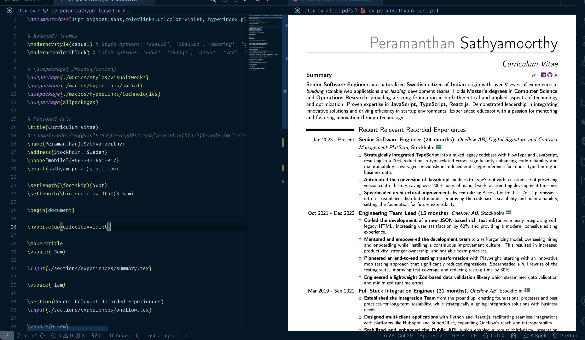

# LaTeX CV Generator

CV build using latex



### Tools

- [MacTeX](https://tug.org/mactex/)

#### VSCode Plugins

- [vscode-pdf](https://marketplace.visualstudio.com/items?itemName=tomoki1207.pdf)
- [LaTeX Workshop](https://marketplace.visualstudio.com/items?itemName=James-Yu.latex-workshop)
- [Overleaf](https://marketplace.visualstudio.com/items?itemName=iamhyc.overleaf-workshop) (online templates)

### Manual generation

Run

```sh
pdflatex <.tex filename>
```

### Auto generating PDFs using vscode plugin update the following setting in IDE

Refer the [settings](vscode/settings.json)

### GitHub Action Workflow

This project uses a Rust Cargo project with the AWS SDK to generate PDFs and push them to S3 buckets.
The rust script also does the following:

```rs
create_bucket_if_not_exists(&client).await?;
set_bucket_policy(&client).await?;
enable_bucket_versioning(&client).await?;
```

- Creates in the bucket is not exists (in future creating new ones becomes easier)
- Set the bucket policy to allow public to read the assets (CVs)
  ```rs
  "Statement": [
    {{
      "Effect": "Allow",
      "Principal": "*",
      "Action": "s3:GetObject",
      "Resource": "arn:aws:s3:::<bucket_name>/<folder_name>/*"
    }}
  ]
  ```
- Enables bucket versioning every time CVs are pushed

### OpenID

GitHub Actions and AWS connected using OpenID and using dedicated role
That can operate only on main branch of this repo to avoid copying
the AWS secrets to GitHub repo or settings.

### Automated Pull requests

In addition to pushing the assets to S3, one of GitHub Action will create
Pull request with generated PDFs

### Credits and gratitude

- [ChatGPT CV Polish using 01-preview model](https://chatgpt.com/share/670684ae-8d00-8005-86fd-fe9c6c6ff779)
