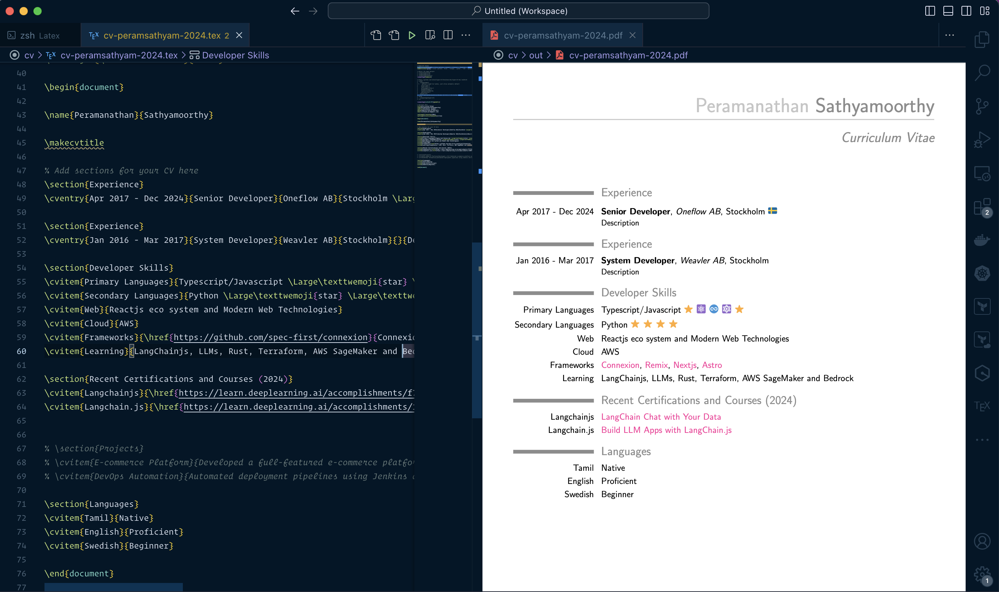

# latex-cv

CV build using latex



### Tools

- [MacTeX](https://tug.org/mactex/)

#### VSCode Plugins

- [LaTeX Workshop](https://marketplace.visualstudio.com/items?itemName=James-Yu.latex-workshop)
- [Overleaf](https://marketplace.visualstudio.com/items?itemName=iamhyc.overleaf-workshop)

### Manual generation

Run

```sh
pdflatex <.tex filename>
```

#### Auto generating PDFs

Refer the [settings](vscode/settings.json)
